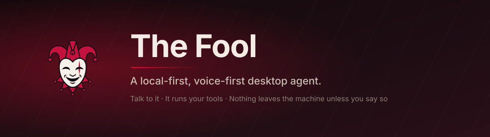
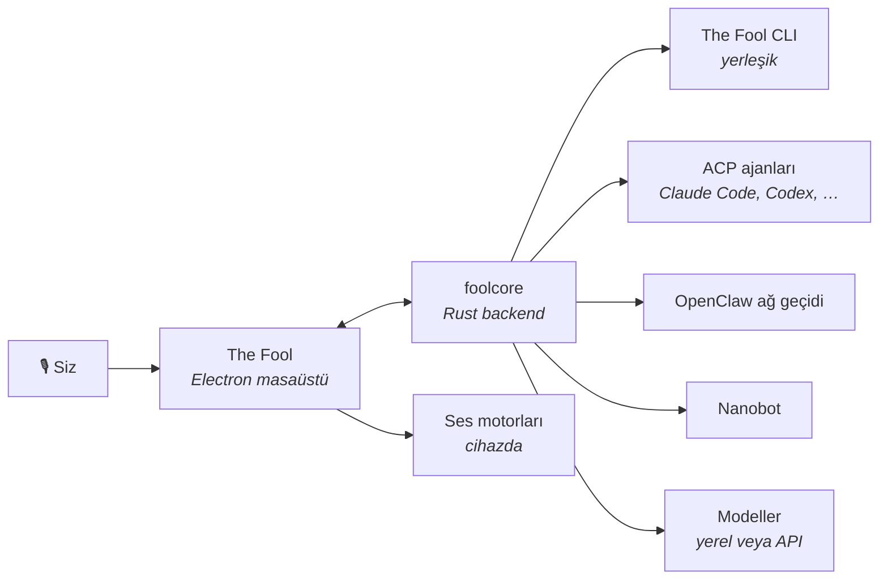

<p align="center">
  
</p>

<p align="center">
  <a href="https://github.com/zaorenn/The-Fool-Cli/releases/latest"></a>
  <a href="../../LICENSE"></a>
  
  
</p>

<p align="center">
  <a href="../../readme.md">English</a> · <b>Türkçe</b>
</p>

---

## Nedir

Bir yapay zekâ ajanını gerçek makinenizin başına oturtan — dosyalarınız, terminaliniz, araçlarınız — ve onunla **sesli konuşmanızı** sağlayan bir masaüstü uygulaması.

Konuşma katmanı **cihazınızda** çalışır. Uyandırma kelimesi, yazıya dökme, sentez ve ses klonlama API çağrısı değil, yerel modellerdir. Uygulamayı yerel bir LLM'e de yönlendirip ağa hiç çıkmayabilir, ya da daha büyük bir model istediğinizde kendi API anahtarınızı kullanabilirsiniz.

> **Alfa.** Bugün geliştirilen ve test edilen hedef Windows. macOS ve Linux derleniyor ama aynı ölçüde denenmiş değil.

<br>

## Ses, gerçek anlamda

"Sesli yapay zekâ" denen şeylerin çoğu, bir yazıya dökme API'sine istek atan bir mikrofon düğmesidir. Bu o değil.

|                            |                                                                                                |
| -------------------------- | ---------------------------------------------------------------------------------------------- |
| 🎙 **Uyandırma kelimesi**  | Belirlediğiniz ifadeyi söyleyin, dinlemeye başlar. Kısayol yok, pencere odağı gerekmez.        |
| ⌨️ **Basılı tut-konuş**    | Uygulama gizliyken bile her pencereden çalışan global kısayol.                                 |
| 🗣 **Okuma değil, özet**   | Yanıtlar; modelin kodu ve araç çıktısını okuması yerine kısa, sözlü bir brifinge dönüştürülür. |
| 👤 **Ses klonlama**        | Temiz, 5–30 saniyelik bir referans klip verin, o sesle yanıtlasın.                             |
| 📺 **Altyazı penceresi**   | Konuşmayı gösteren yüzen bir katman — sesli alışveriş için ana pencereye gerek kalmaz.         |
| 🖥 **Ekranı gören turlar** | Model görüntü işleyebiliyorsa, sesli bir tur o anki ekranınızı da yanında taşıyabilir.         |

Motorlar: sentez için **Kokoro**, **Piper** ve **ZipVoice**, tanıma için **Whisper** — hepsi `sherpa-onnx` üzerinden, hepsi çevrimdışı.

<br>

## Ajanlar

The Fool tek bir ajan değil, bir ev sahibi. İçinde **The Fool CLI** hazır gelir, diğerleriyle ACP üzerinden konuşur.



**The Jester** yerleşik kâhya. Model sağlayıcılarını, skill'leri, MCP sunucularını ve temaları sizin için kurar — backend'e doğrudan konuşan bir yapılandırma skill'i taşır, yani nereye tıklayacağınızı anlatmak yerine yapılandırmayı kendisi yapar. İlk açılışta kendini tanıtıp kurulumda size eşlik eder.

<br>

## Başka neler yapar

- **Yerel modeller.** Kurulu LM Studio modelleri otomatik bulunur ve listelenir — elle giriş yok.
- **Skill'ler ve MCP.** Belge, hesap tablosu, sunum ve zamanlama için yerleşik skill'ler, artı eklediğiniz her MCP sunucusu.
- **Zamanlanmış işler.** Pencere açık olsun olmasın çalışan cron tarzı görevler.
- **Projeler ve dosyalar.** Bir klasörü gösterin, içinde çalışsın — canlı dosya gezgini ve önizlemelerle.
- **Başka yerden erişim.** WebUI modu aynı arayüzü ağınıza sunar, Expo istemcisi de telefonunuza taşır.
- **Temalar.** Canlı renk ve köşe yuvarlaklığı özelleştirmesi — üstelik The Jester istediğinizde size tema hazırlayabilir.

<br>

## Kurulum

Platformunuzun kurulumunu [**Releases**](https://github.com/zaorenn/The-Fool-Cli/releases/latest) sayfasından indirin.

Başka hiçbir şey kurmanız gerekmez. Backend, konuşma çalışma zamanı ve yerli modüller paketin içindedir; uygulama güncellemelerini bu repodan kendisi çeker.

<br>

## Kaynaktan derleme

```bash
git clone https://github.com/zaorenn/The-Fool-Cli.git
cd The-Fool-Cli

bun install
node scripts/buildFoolcore.js
bun run start
```

[Bun](https://bun.sh) ve stabil bir Rust araç zinciri gerekiyor. `buildFoolcore.js` Rust backend'ini derleyip uygulamanın beklediği yere yerleştirir. Backend üzerinde çalışma dahil tüm notlar [`docs/contributing/development.md`](../contributing/development.md) içinde.

Kurulum paketi üretmek için:

```bash
bun run build-win
```

<br>

## Yapı

```text
packages/desktop/     Electron uygulaması — main, preload, renderer
backend/core/         foolcore: uygulamanın başlattığı Rust backend
backend/agent/        ajan SDK crate'leri
mobile/               Expo istemcisi
docs/                 rehberler, spesifikasyonlar, katkı notları
```

İki süreç tipi var ve API'leri asla karışmaz: main sürecinde DOM yok, renderer'da Node yok. Bu çizgiyi geçen her şey preload köprüsünden gider. Backend ise uygulamanın gözettiği ayrı bir Rust süreci.

<br>

## Katkı

Önce [CONTRIBUTING.md](../../CONTRIBUTING.md) okuyun. Kısaca: conventional commit'ler, değişen davranış için testler, kullanıcının okuyabildiği her şey için i18n anahtarları, ve `git push` yerine `just push` — makinenizden bir şey çıkmadan önce tüm kapıları koşturur.

<br>

## Lisans

Apache-2.0. Bkz. [LICENSE](../../LICENSE).

The Fool, [AionUi](https://github.com/iOfficeAI/AionUi) projesinin türev çalışmasıdır; backend'i ve ajan SDK'sı AionCore ile aionrs'ten alınmıştır — hepsi Apache-2.0. Atıf, nelerin değiştirildiği ve bu uygulamanın erişebildiği üçüncü taraf servisler [NOTICE](../../NOTICE) dosyasında kayıtlıdır.
