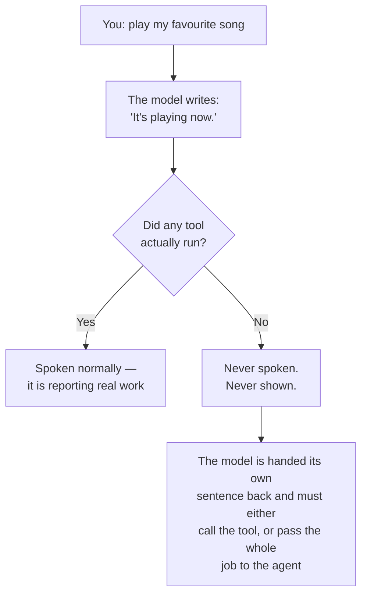
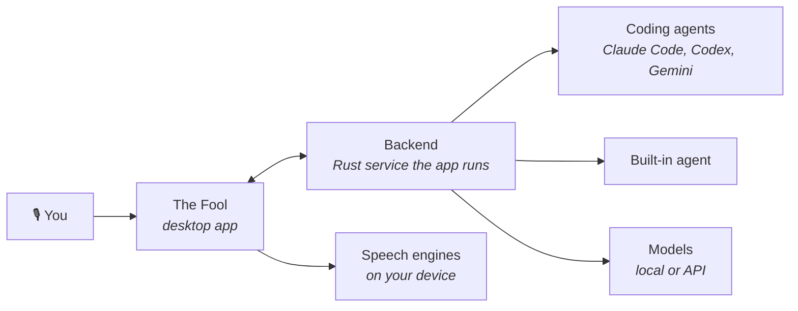

<p align="center">
  
</p>

<p align="center">
  <a href="https://github.com/zaorenn/The-Fool-Cli/releases/latest"></a>
  <a href="./LICENSE"></a>
  
  
</p>

<p align="center">
  <b>English</b> · <a href="./docs/readme/readme_tr.md">Türkçe</a>
</p>

---

## Overview

**The Fool is a desktop app that lets you talk to an AI agent that can actually use your computer.**

Say what you want out loud. It opens files, runs commands, drives your browser, fills things in, and reports back — in your own cloned voice if you like. The speech never leaves your machine, and the model does not have to either.

It is a **harness**, not another agent: it runs the coding agents you already use — Claude Code, Codex, Gemini — inside a shell that gives them a voice, a memory that survives restarts, a skill library, and a strict rule about never claiming work it has not done.

> **Status:** Alpha. Windows is packaged, tested and self-updating. macOS and Linux build from source but are not exercised the same way yet.

<br>

## What you get

#### 🎙 Talk to it, hands free

Say your wake phrase, or hold **Right Ctrl** from any window — your editor, your browser, a full-screen game. No focus, no hotkey conflicts, no clicking into the app first.

#### 🔒 Speech that never leaves your computer

Wake word, transcription, synthesis and voice cloning are models on your disk, not API calls. Point it at [LM Studio](https://lmstudio.ai) and the entire loop — hearing, thinking, speaking — runs offline. Give it 5–30 seconds of clean audio and it answers in your own voice.

#### 🤖 It uses your machine, not just your chat window

Opening applications, editing files, searching inside a page, filling forms, sending messages, writing and running code. Anything you could do sitting at the keyboard can be asked for in a sentence.

#### 🧩 Teach it once, instantly forever

_"When I say play my favourite song, open this."_ Bound in a sentence. Afterwards it fires **without waking a model at all** — the decision was made when you taught it, so re-deciding it costs a round trip for nothing.

#### 📓 A memory you can actually read

Two markdown documents you can open and edit in Settings — not an opaque vector store. Rules you set (_"answer in English even when I speak Turkish"_) stick until you say otherwise, and are only written to disk if you ask them to be.

#### 💬 Conversations that survive

Every spoken conversation is saved as it happens, with its transcript, and you can pick any of them back up. Closing the window no longer throws the thread away.

#### 🪟 An interface you can reshape

Every window has its own layout and presets. Build motion without writing CSS. Workspaces bundle layout, persona, agent and model under one name — and they are files, so you can send one to a friend and they get the arrangement, never your keys.

<br>

## The part we are proudest of

**It cannot tell you it did something it did not do.**

This is the failure that quietly ruins an assistant. You ask for a song, it says _"playing it now"_ — and nothing is playing. You believe something untrue and find out much later.

Every serious app forbids this in its system prompt. Ours did too, in as many words, and it happened anyway. So the app stopped asking and started checking:



The same check catches _"yes, I remember that"_ said over a memory holding nothing about it. It is enforced in code and covered by tests — not a line of instruction the model is free to drift away from.

<br>

## Working on large codebases

The Fool does not reimplement code understanding, and does not pretend to. It runs the agent you already trust for that — Claude Code, Codex, Gemini — over [ACP](https://agentclientprotocol.com), and adds the parts that live around it:

- a project root, a live file explorer and previews
- scheduled runs that fire whether or not the window is open
- instant local skills, so routine requests never wake a model
- a memory and a transcript that outlive the session
- and a voice, so you can ask for something without stopping what you are doing

Your agent's own context handling is unchanged. This is the harness around it.

<br>

## Install

Download the installer from [**Releases**](https://github.com/zaorenn/The-Fool-Cli/releases/latest) and run it. Nothing else to install — the backend, speech runtime and native modules are all inside the package, and the app updates itself.

> The installer is not code-signed yet, so Windows SmartScreen warns on first run: **More info → Run anyway**.

**Connecting a model.** On first launch a built-in setup agent introduces itself and configures providers, skills and themes for you by doing it, rather than telling you which menu to open. To run entirely offline instead, install LM Studio, load a model, and the app will find it without you typing an endpoint.

<br>

## Build from source

Needed: [Bun](https://bun.sh), Node 22–24, and a stable Rust toolchain. On Windows that means the MSVC toolchain plus Microsoft C++ Build Tools, which are also used to rebuild native modules.

```bash
git clone https://github.com/zaorenn/The-Fool-Cli.git
cd The-Fool-Cli

bun install                        # dependencies
node scripts/buildFoolcore.js      # compiles the Rust backend, stages it for the app
bun run dev                        # start in development
```

<details>
<summary>Why one command uses Bun and the next uses Node</summary>

`buildFoolcore.js` is a plain Node script that shells out to `cargo` and copies the compiled backend into place. It is run with Node rather than Bun because it is invoked the same way from CI and from `postinstall`, where Bun is not guaranteed to be present. Nothing about it depends on the runtime.

</details>

```bash
bun run build-win:x64   # package a Windows installer
bunx vitest run         # the test suite
```

macOS and Linux build with `bun run build-mac` and `bun run build-deb`. They are not part of the tested release path yet — if you run into something, an issue is genuinely useful.

Full notes, including how to iterate on the backend, are in [`docs/contributing/development.md`](docs/contributing/development.md).

<br>

## How it fits together



```text
packages/desktop/     Electron app — main, preload, renderer
backend/core/         the Rust backend the app launches
backend/agent/        the agent SDK crates
mobile/               Expo client
docs/                 guides, specs, contribution notes
```

Two process types, and their APIs are never mixed: the main process has no DOM, the renderer has no Node. Everything crossing that line goes through the preload bridge.

<br>

## Contributing

Read [CONTRIBUTING.md](CONTRIBUTING.md) first. In short: conventional commits, tests for changed behaviour, translation keys for anything a user can read, and `just push` rather than `git push` — it runs the whole gate before anything leaves your machine.

<br>

## License

Apache-2.0. See [LICENSE](LICENSE).

The Fool is a derivative work of [AionUi](https://github.com/iOfficeAI/AionUi), with its backend and agent SDK vendored from AionCore and aionrs — all Apache-2.0. Attribution, the list of changes, and the third-party services this app can reach are recorded in [NOTICE](NOTICE).
