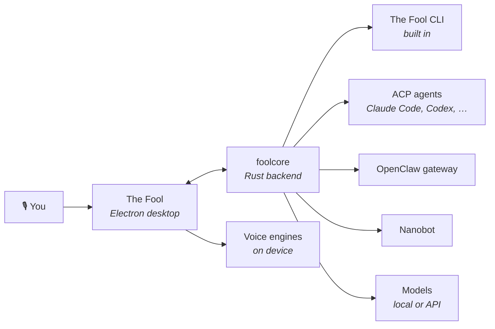

<p align="center">
  
</p>

<p align="center">
  <a href="https://github.com/zaorenn/The-Fool-Cli/releases/latest"></a>
  <a href="./LICENSE"></a>
  
  
  
</p>

<p align="center">
  <b>English</b> · <a href="./docs/readme/readme_tr.md">Türkçe</a>
</p>

<p align="center">
  <i>An agent harness you can talk to. Your machine, your models, your voice.</i>
</p>

---

## The one-paragraph version

The Fool is a desktop **agent harness**: it puts a real agent in front of your actual computer — your files, your terminal, your browser, your applications — and lets you drive it by **speaking to it**. The speech stack runs on your device. The model can too. It hosts the agents you already use over ACP rather than replacing them, so Claude Code or Codex does the heavy work inside a harness that has a voice, a memory, a skill library and a face.

> **Alpha.** Windows is the developed and tested target today. macOS and Linux build, but are not exercised the same way.

<br>

## Why this one

Most "AI desktop apps" are a chat box with a microphone button. The three things below are what separate this from that, and each is a decision you can go and read in the code.

### 1. It cannot tell you it did something it did not do

This is the failure that ruins an assistant. You ask for your favourite song, it says _"playing it now"_, and nothing is playing. You believe something untrue and find out later.

The prompt has always forbidden this. Prompts do not hold. So the app checks instead:

```text
 you: "play my favourite song"
        │
        ▼
 model writes: "It's playing now."      ← claims a finished action
        │
        ▼
 harness: did any tool run this turn?   ← no
        │
        ▼
 the sentence is never spoken, never shown
        │
        ▼
 the model is handed its own sentence back, and must either
 call the tool or hand the whole job to the agent
```

The same guard covers _"yes, I remember that"_ said over a memory holding nothing about it. **Refusing to lie is a feature with a test suite**, not a sentence in a system prompt.

### 2. Speech that is genuinely local

|                              |                                                                                                         |
| ---------------------------- | ------------------------------------------------------------------------------------------------------- |
| 🎙 **Wake word**             | Say your phrase and it listens. No hotkey, no focus, no window.                                         |
| ⌨️ **Push-to-talk**          | Right Ctrl, global — works from your editor, your browser, a full-screen game.                          |
| 🧠 **Local thinking**        | Point it at LM Studio and the whole loop — hearing, thinking, speaking — never leaves the machine.      |
| 👤 **Your own voice**        | Five to thirty seconds of clean reference audio and it answers in that voice.                           |
| 🗣 **Briefed, not read out** | Replies are summarised into something worth hearing rather than code and tool output recited.           |
| 📺 **The notch**             | A floating strip that says what is happening right now, over whatever you are doing.                    |
| 🖥 **Screen-aware**          | "What does this error mean" makes it _look_ — and it never describes a screen it has not actually seen. |

Engines: **Pocket**, **Supertonic**, **Chatterbox** and **Qwen3-TTS** through audio.cpp; **Kokoro**, **Piper** and **ZipVoice** through `sherpa-onnx`; **Whisper** for recognition. All offline, all on device.

### 3. It gets better the more you use it

|                              |                                                                                                                                       |
| ---------------------------- | ------------------------------------------------------------------------------------------------------------------------------------- |
| 🧩 **Teach it out loud**     | _"When I say play my favourite song, open this."_ Bound instantly, and it runs with **no model round trip** afterwards.               |
| 📓 **A memory you can read** | Two markdown documents you can open and edit in Settings, not an opaque vector store.                                                 |
| 📜 **Rules that stick**      | _"Answer in English even when I speak Turkish."_ Placed last in the prompt so it wins — and written down only if you ask.             |
| 💬 **Conversations kept**    | Every spoken conversation is saved as it happens, with its transcript, and you can carry on from any of them.                         |
| 🔍 **Withdrawable**          | Everything it taught itself is listed with the real address or program in full. A capability you cannot see is one you cannot revoke. |

<br>

## The harness

The Fool is a host, not a single agent.



**On a large codebase, the agent is the agent.** The Fool does not re-implement code understanding — it hosts the tool you already trust for that over ACP and gives it a project root, a live file explorer, scheduled runs and a voice. What the harness adds is everything _around_ the agent: request routing, skills that answer instantly without waking a model, a memory that survives restarts, and the guarantee that what you were told happened actually happened.

**The Jester** is the built-in butler. It creates model providers, installs skills, adds MCP servers and writes themes — it holds a config skill that talks straight to the backend, so it _does_ the configuration rather than telling you where to click.

<br>

## Make it yours

|                                  |                                                                                                                       |
| -------------------------------- | --------------------------------------------------------------------------------------------------------------------- |
| 🪟 **Every window is shapeable** | Voice page, chat, Fool's Hub and the app frame each have their own layout, presets and axes.                          |
| 🎞 **Motion without CSS**        | Choose what moves, how it arrives and how fast; watch it play on a real element, then keep it.                        |
| 🤖 **Designed by another AI**    | Copy the app's own spec into whichever assistant you use, describe a look, drop the answer in. No key leaves.         |
| 🧳 **Workspaces are files**      | Layout, persona, agent and model under one name — send one to a friend and they get the arrangement, never your keys. |
| 🦾 **JARVIS ships with it**      | A second workspace with its own palette and four layouts, animated, there to be taken apart.                          |

<br>

## Everything else

- **Local models discovered automatically.** Installed LM Studio models are listed without you typing an endpoint.
- **Skills and MCP.** Built-in skills for documents, spreadsheets, slides and scheduling, plus any MCP server you add — and addons a workspace can declare and install, never without showing you the command first.
- **Scheduled work.** Cron-style jobs that run whether or not the window is open.
- **Projects and files.** Point it at a folder and it works inside it, with a live explorer and previews.
- **Reachable elsewhere.** A WebUI mode serves the same interface over your network; an Expo client puts it on your phone.
- **Quiet updates.** They install without an installer window, bring the app straight back up, and then tell you what changed.

<br>

## Install

Download the installer from [**Releases**](https://github.com/zaorenn/The-Fool-Cli/releases/latest).

Nothing else to install — the backend, the speech runtime and the native modules are all inside the package, and the app updates itself from this repository.

> The installer is not code-signed yet, so SmartScreen warns on first run: **More info → Run anyway**.

**To go fully local**, install [LM Studio](https://lmstudio.ai), load a model, and choose it in Settings → Voice. The app finds it by itself.

<br>

## Build from source

```bash
git clone https://github.com/zaorenn/The-Fool-Cli.git
cd The-Fool-Cli

bun install
node scripts/buildFoolcore.js
bun run dev
```

You need [Bun](https://bun.sh), Node 22–24, and a stable Rust toolchain — on Windows the MSVC one plus Microsoft C++ Build Tools, which `bun install` also uses to rebuild native modules. `buildFoolcore.js` compiles the Rust backend and stages it where the app expects it. Full notes are in [`docs/contributing/development.md`](docs/contributing/development.md).

```bash
bun run build-win:x64   # package an installer
bunx vitest run         # the test suite
```

<br>

## Layout

```text
packages/desktop/     Electron app — main, preload, renderer
backend/core/         foolcore: the Rust backend the app launches
backend/agent/        the agent SDK crates
mobile/               Expo client
docs/                 guides, specs, contribution notes
```

Two process types, and their APIs are never mixed: the main process has no DOM, the renderer has no Node. Everything crossing that line goes through the preload bridge. The backend is a separate Rust process the app supervises.

<br>

## Contributing

Read [CONTRIBUTING.md](CONTRIBUTING.md) first. In short: conventional commits, tests for changed behaviour, i18n keys for anything a user can read, and `just push` rather than `git push` — it runs the whole gate before anything leaves your machine.

<br>

## License

Apache-2.0. See [LICENSE](LICENSE).

The Fool is a derivative work of [AionUi](https://github.com/iOfficeAI/AionUi), with its backend and agent SDK vendored from AionCore and aionrs — all Apache-2.0. Attribution, the list of what was changed, and the third-party services this app can reach are recorded in [NOTICE](NOTICE).
