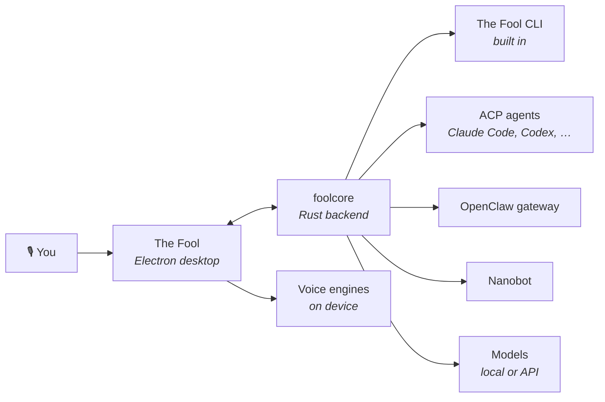

<p align="center">
  
</p>

<p align="center">
  <a href="https://github.com/zaorenn/The-Fool-Cli/releases/latest"></a>
  <a href="./LICENSE"></a>
  
  
</p>

<p align="center">
  <b>English</b> · <a href="./docs/readme/readme_tr.md">Türkçe</a>
</p>

---

## What it is

A desktop app that puts an AI agent in front of your actual machine — your files, your terminal, your tools — and lets you **talk to it out loud**.

The speech stack runs **on your device**. Wake word, transcription, synthesis and voice cloning are local models, not API calls. You can point the app at a local LLM too and never touch the network at all, or bring your own API key when you want a bigger model.

> **Alpha.** Windows is the developed and tested target today. macOS and Linux build, but are not yet exercised the same way.

<br>

## Voice, properly

Most "voice AI" is a microphone button that posts to a transcription API. This isn't that.

|                                |                                                                                                              |
| ------------------------------ | ------------------------------------------------------------------------------------------------------------ |
| 🎙 **Wake word**               | Say the phrase you configured and it starts listening. No hotkey, no window focus.                           |
| ⌨️ **Push-to-talk**            | A global shortcut that works from any window, including when the app is hidden.                              |
| 🗣 **Read back, not read out** | Replies get summarised into a short spoken briefing instead of the model reading code and tool output aloud. |
| 👤 **Voice cloning**           | Give it a clean 5–30 second reference clip and it will answer in that voice.                                 |
| 📺 **Caption window**          | A floating overlay showing the conversation, so a spoken exchange doesn't need the main window.              |
| 🖥 **Screen-aware turns**      | When the model can see images, a spoken turn can carry your current screen with it.                          |

Engines: **Kokoro**, **Piper** and **ZipVoice** for synthesis, **Whisper** for recognition — all through `sherpa-onnx`, all offline.

<br>

## Agents

The Fool is a host, not a single agent. It ships with **The Fool CLI** built in, and speaks to others over ACP.



**The Jester** is the built-in butler. It sets up model providers, skills, MCP servers and themes for you — it holds a config skill that talks straight to the backend, so it does the configuration rather than telling you where to click. On a first launch it introduces itself and walks you through setup.

<br>

## What else it does

- **Local models.** Installed LM Studio models are discovered and listed automatically — no manual entry.
- **Skills and MCP.** Built-in skills for documents, spreadsheets, slides and scheduling, plus any MCP server you add.
- **Scheduled work.** Cron-style jobs that run whether or not the window is open.
- **Projects and files.** Point it at a folder and it works inside it, with a live file explorer and previews.
- **Reachable elsewhere.** A WebUI mode serves the same interface over your network, and an Expo client puts it on your phone.
- **Themes.** Live colour and corner-radius customisation — and The Jester can build you a theme on request.

<br>

## Install

Download the installer for your platform from [**Releases**](https://github.com/zaorenn/The-Fool-Cli/releases/latest).

Nothing else to install. The backend, the speech runtime and the native modules are all inside the package, and the app updates itself from this repository.

<br>

## Build from source

```bash
git clone https://github.com/zaorenn/The-Fool-Cli.git
cd The-Fool-Cli

bun install
node scripts/buildFoolcore.js
bun run dev
```

You need [Bun](https://bun.sh), Node 22–24, and a stable Rust toolchain — on Windows, the MSVC one plus Microsoft C++ Build Tools, which `bun install` also uses to rebuild the native modules. `buildFoolcore.js` compiles the Rust backend and stages it where the app expects it; the backend downloads the Node runtime and agent CLIs it needs on first run. Full notes, including how to iterate on the backend, are in [`docs/contributing/development.md`](docs/contributing/development.md).

To package an installer:

```bash
bun run build-win
```

<br>

## Layout

```text
packages/desktop/     Electron app — main, preload, renderer
backend/core/         foolcore: the Rust backend the app launches
backend/agent/        the agent SDK crates
mobile/               Expo client
docs/                 guides, specs, contribution notes
```

Two process types, and their APIs are never mixed: the main process has no DOM, the renderer has no Node. Everything crossing that line goes through the preload bridge. The backend is a separate Rust process the app supervises.

<br>

## Contributing

Read [CONTRIBUTING.md](CONTRIBUTING.md) first. In short: conventional commits, tests for changed behaviour, i18n keys for anything a user can read, and `just push` rather than `git push` — it runs the whole gate before anything leaves your machine.

<br>

## License

Apache-2.0. See [LICENSE](LICENSE).

The Fool is a derivative work of [AionUi](https://github.com/iOfficeAI/AionUi), with its backend and agent SDK vendored from AionCore and aionrs — all Apache-2.0. Attribution, the list of what was changed, and the third-party services this app can reach are recorded in [NOTICE](NOTICE).
